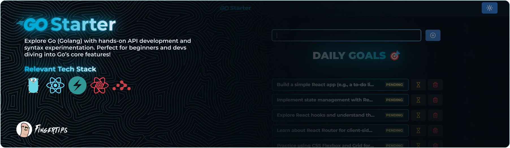

# 🚀 Go Starter

This repository serves as a playground for exploring **Go (Golang)** features, including **API development**, **syntax experimentation**, and learning the **basics of Go** programming. Ideal for beginners and developers looking to get hands-on experience with **Go**.

### 🔗 Website Link: [Live](https://go-starter.onrender.com/)

## 📚 Table of Contents

- 🔧 [Technologies Used](#tech-used)

- ✨ [Features](#features)

- 📖 [Setup Instructions](#setup)

- 🚀 [Backend (Go)](#backend)

- ⚛️ [Frontend (React JS)](#frontend)

- 📡 [API Endpoints](#api)

- 🤝 [Contributing](#contributing)

- 📜 [License](#license)

## 🔧 <a name="tech-used">Technologies Used</a>

- **Frontend**: React JS ⚛️

- **Backend**: Go (Golang) 🚀

- **Database**: MongoDB 🗄️

- **UI**: Chakra UI 🏠

- **Query**: Tanstack Query 🌐

## ✨ <a name="features">Features</a>

- **📝 CRUD Operations**: Create, Read, Update, and Delete operations for user and application data.

- **📱 Responsive UI**: Developed using **Chakra UI** components, ensuring a seamless experience across devices.

- **📡 API**: Robust API constructed using **Express.js** and **MongoDB** for seamless data interaction.

## 📖 <a name="setup">Setup Instructions</a>

### 🛠️ <a name="backend">Backend Go (Golang)</a>

1. **Clone the repository**:

   ```bash
   git clone https://github.com/Fingertips18/go-starter.git
   ```

2. **Install dependencies**:

   ```bash
   cd go-starter
   go mod tidy
   ```

3. **Set up environment variables. Create a `.env` file in the root directory:**:

   ```bash
   MONGO_URI=your-mongo-uri
   PORT=5000
   MODE=development
   CLIENT_URL=your-client-url
   ```

4. **Run the backend server**:
   ```bash
   go run main.go
   // or
   go install github.com/air-verse/air@latest
   air
   ```

### ⚛️ <a name="frontend">Frontend (React JS)</a>

1. **Navigate to the frontend directory**:

   ```bash
   cd client
   ```

2. **Install dependencies**:

   ```bash
   npm install
   ```

3. **Set up environment variables. Create a `.env` file in the frontend directory**:

   ```bash
   VITE_BASE_URL=http://localhost:5000  # Adjust the backend URL if necessary
   ```

4. **Run the frontend server**:
   ```bash
   npm run dev
   ```

## 📡 <a name="api">API Endpoints</a>

- **Todos**:

- `GET` **/api/todos**: Retrieve a list of todos.

- `GET` **/api/todos/:id**: Retrieve a single todo by ID.

- `POST` **/api/todos**: Create a new todo.

- `PATCH` **/api/todos/:id**: Update an existing todo by ID.

- `DELETE` **/api/todos/:id**: Delete a todo by ID.

## 🤝 <a name="contributing">Contributing</a>

Feel free to fork this repository and contribute by submitting a pull request. All contributions are welcome!

#### 🧑‍💻 Contributors

<a href="https://github.com/Fingertips18/scroll-wheel-date-picker/graphs/contributors">
  
</a>

_Ghian Tan_ @ _Fingertips_ ([Github](https://github.com/Fingertips18))

## <a name="license">📜 License</a>

This project is licensed under the MIT License.
